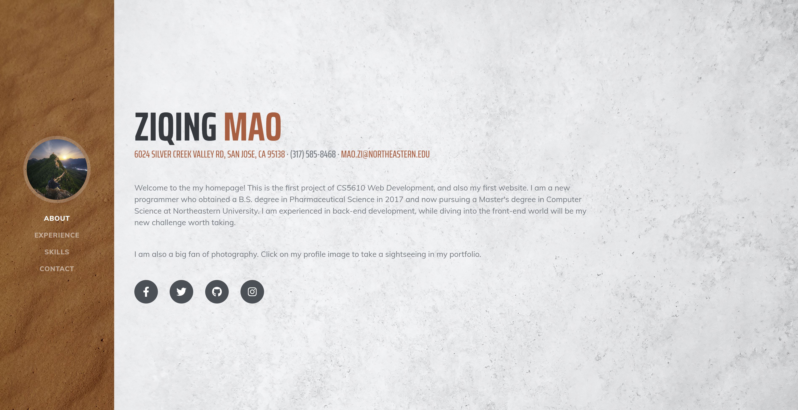

# CS5610 Project 1 Homepage

https://github.com/Ziqing19/homepage

## Arthor
Made by [Ziqing Mao](https://github.com/Ziqing19/)

[Class link](https://johnguerra.co/classes/webDevelopment_spring_2021/)

## Project Objective
In this project, we are supposed to build a personal website by basically Bootstrap and Vanilla JS. 
There should be at least two pages introducing our skills, projects, hobbies, etc, and templates are allowed.
The final product should be of W3C compliance, as well as formatted by eslint and prettier.

## Screenshot

## Video Presentation
TBD

## Usage
In order to run it, you may access it directly by https://github.com/Ziqing19/homepage. 

Moreover, you may clone the repository and run it locally either on your local server, or through a browser (tested on Chrome desktop).

## Copyright
This webpage take advantage of templates from [startbootstrap](https://startbootstrap.com/theme/resume/) and [mobirise](https://mobirise.com/bootstrap-template/carousel-template.html).
This project is under MIT license. All modified image resources could be distributed with same methods. Photos of myself will be shared with CC 4.0 BY-NC-ND license.
